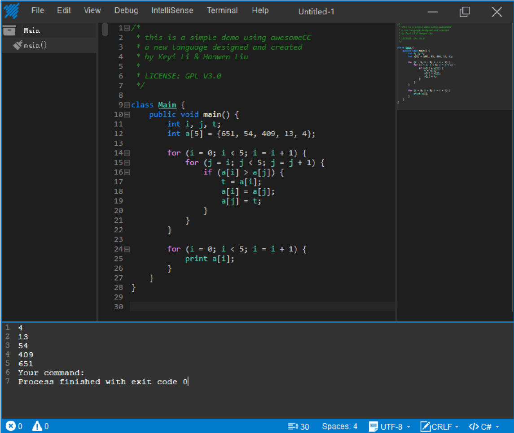

# A#


Awesome C# subset compiler for Compile Principle Course Design. 

## preview

- GUI is developed by @iLHW.


Documentations can be found in `/doc`.

## installation

```bash
cmake .
make
```


------


# A#


编译原理课程设计开发的C#子集编译器。

## 预览

- GUI由@iLHW 开发。
  

文档详见 `/doc`.

## 安装

```bash
cmake .
make
```


